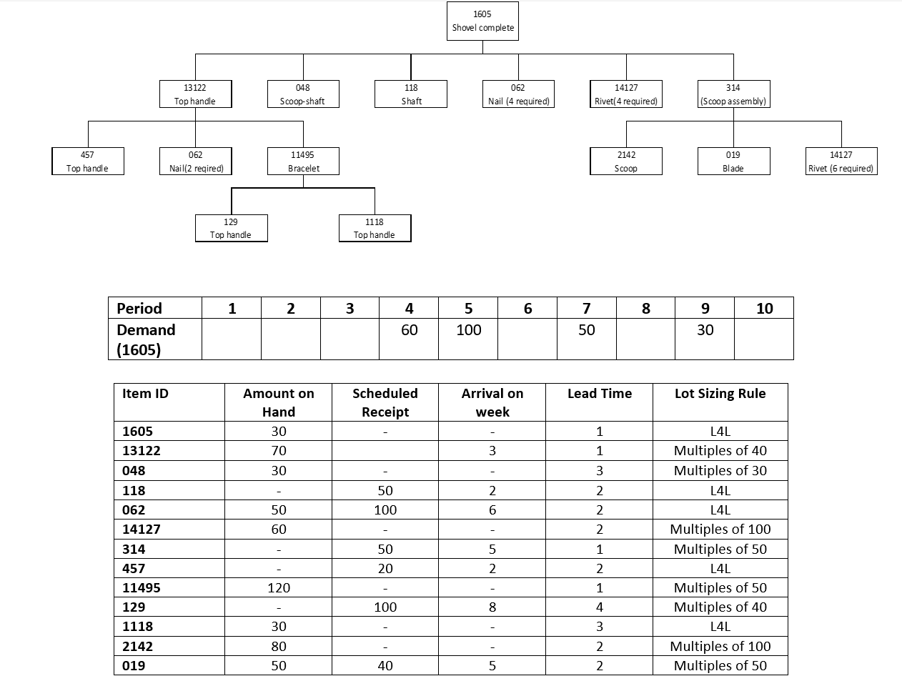
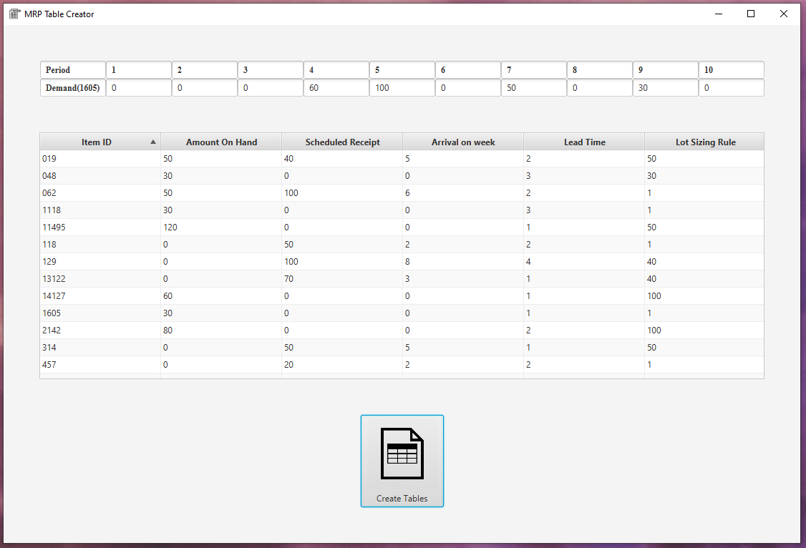
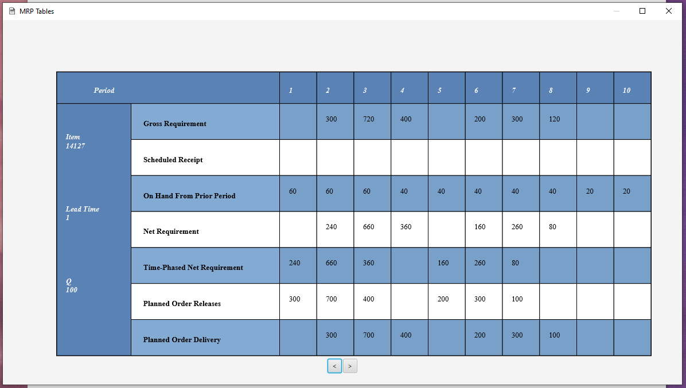

# MRP Table Creator

Project Request:
	Develop a computer program that takes bill of material and the gross requirements of the end item along with the stock,
scheduled receipt, arrival on week, lead time and lot sizing rule information of the subcomponents to create MRP records
for all parts and components of the snow shovel. You are free to use any programming language with your peers from Computer
Engineering department. However, the generated outputs of the designed code must exactly match the MRP record standards.
Your code should be able to handle parent/child relationships, low level coding and interactions between parent and child
components in terms of generating gross requirements for all subcomponents.



### Running

* Create executable for project.
```
mvn package
```
* mrp-table-creator.exe under target is executable form of project.

Instructions :
There are two windows for input and output.
* The .exe file does not work correctly on the first attempt (antivirus issues).
   It will open in the second attempt.
* Please try to run it from .exe file, if not succeed please try maven project.
   If you are going to run it from JavaClasses folder, changes must be done for packaging and image inputs.
* In the input window, one can change the demand fields.
* Also double clicking on item property (Amount on hand, Lead time, etc...)
   lets user to change the value and pressing enter will set the value.
* Lot sizing rule is in integer format (1 corresponds l4l, 20 corresponds multiples of 20, etc...)
* Lastly create tables button opens the output window.
* In the output window, one can slide between mrp tables.

## Screenshots





## Project Structure

Tasks of the classes:
*	Item class represents an item with data fields: Item ID, Amount on Hand, Scheduled Receipt, Arrival on week, Lead Time, Lot Sizing Rule and Item Table.
*	Item Table class represents MRP table for an item.
*	ItemManager class creates the item objects and stores them in a list. It also deals with finding and retrieving an item.
*	 TreeNode class represents a node of Item Tree with data fields: item(self), item(parent), number of required items, level code and array for children.
*	ItemTree class represents a product tree. It creates parent/child relationships with the help of TreeNode class. It also handles iteration in the tree by the level code.
*	MrpAlg class creates MRP tables with the help of ItemManager and ItemTree. It works with the algorithm given below.
Application starts with creating item objects with default values. These default values and demand of item “1605” can changed from user interface. When user clicks the “create tables” button application writes the demand to the table of item “1605”. Then passes the item list to the MrpAlg object. 

Algorithm:
1.	For each item in the list, write amount on hand value to the table of that item.
2.	For each item in the list, check if there is a scheduled receipt, and if there is a scheduled receipt then write the value to arrival on week.
3.	Create a product tree from item list and start traverse in product tree by the level code.
4.	While traversing in the product tree if the item is not “1605” (Gross requirement of “1605” comes from demand) get the items gross requirement from parents planned order releases. 
5.	Gross requirement has been adjusted for the item. If item has no duplicate in product tree start calculating net requirement. If item has duplicate calculate its net requirement at deeper level.
6.	Start from first period, iterate to the 10th period.

For each period:

7.	Calculate total amount on hand (amount on hand + scheduled receipt (if any)).
8.	Check if there is a gross requirement. 
9.	If gross requirement is zero, then write total to the next period amount on hand.
10.	If there is a gross requirement. Check if total covers the gross requirement.
11.	If total covers the gross requirement, subtract gross requirement from total. Write it to the next period amount on hand.
12.	If total does not cover the gross requirement, subtract total from gross requirement. Write the value to (current period) net requirement.
13.	Write (current period) net requirement value to time-phased net requirement at (current period – lead time).
14.	Calculate the order value by using lot sizing rule and net requirement. (Increment the order value to multiples of lot sizing rule until the order value covers the net requirement).
15.	Write order value to (current period – lead time) planned order releases.
16.	Write order value to (current period) planned order delivery.
17.	Calculate ((current period) planned order delivery – (current period) net requirement). Write the value to next period amount on hand.


## Built With

* [Maven](https://maven.apache.org/) - Dependency Management

## License

This project is licensed under the MIT License - see the [LICENSE.md](LICENSE.md) file for details